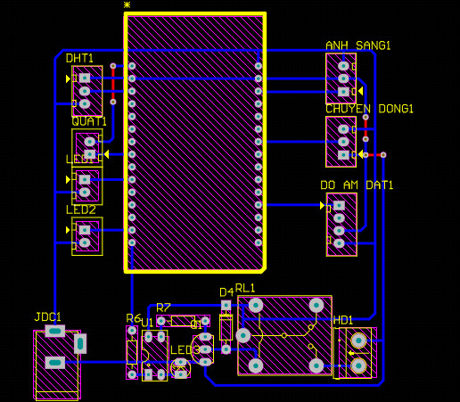
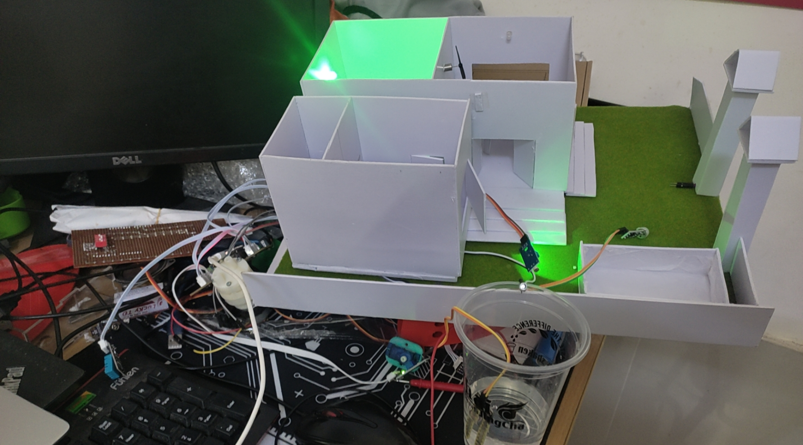

# ESP32-RTOS-Blynk
Project Smart home using ESP32 and blynk cloud  
# RTOS

To ease the development of complex programs, I tried some simple RTOS.

## What is RTOS

A real-time operating system (RTOS) is an operating system (OS) for real-time applications that processes data and events that have critically defined time constraints. An RTOS is distinct from a time sharing operating system, such as Unix, which manages the sharing of system resources with a scheduler, data buffers, or fixed task prioritization in a multitasking or multiprogramming environment. Processing time requirements need to be fully understood and bound rather than just kept as a minimum. All processing must occur within the defined constraints. Real-time operating systems are event-driven and preemptive, meaning the OS is capable of monitoring the relevant priority of completing tasks, and make changes to the task priority. Event-driven systems switch between tasks based on their priorities, while time-sharing systems switch the task based on clock interrupts.

[ESP32 RTOS Guide](https://docs.espressif.com/projects/esp-idf/en/latest/esp32/api-reference/system/freertos.html)

[FreeRTOS](https://www.freertos.org/)


## Feature

- Have the following Tasks: Blynk Task, Sensor Task, Controlling Task and Blynk Callback  
- Reduce complexity  
- Manage Resource for all Tasks  
- Easy to debug and verify  
- Code reuse  


## How to use FreeRTOS

FreeRTOS is included with the Arduino IDE and requires only the ESP32 board to be installed.

First create a task in setup().

```c++
void setup()
{
  xTaskCreatePinnedToCore(Task_DHT11, "Task_DHT11", 8000, NULL, 2, NULL, ARDUINO_RUNNING_CORE);
}
```

Second declare task function. (This is a demo in this respository)

```c++
void Task_DHT11(void *pvParameters)
{
    (void)pvParameters;

    dht.begin();

    while (1) // A Task shall never return or exit.
    {
        h = dht.readHumidity();
        t = dht.readTemperature();
        if (isnan(h) || isnan(t))
        {
            Serial.println(F("Failed to read from DHT sensor!"));
        }
        else
        {
            Serial.print(F("Humidity: "));
            Serial.print(h);
            Serial.print(F("%  Temperature: "));
            Serial.print(t);
            Serial.println(F("°C "));
            if(Blynk.connected() == true)
            {
              Blynk.virtualWrite(V0, int(t));
              Blynk.virtualWrite(V1, int(h));
            }
        }

        vTaskDelay(3000);
    }
}
```

Over.


# Example

### freeRTOSBlynk

This project using Blynk to control Led, Pump and Fan. We can using Auto button to turn on automatic program with Light sensor and humidity sensor, and we have a semi-automatic program, we can control led, pump in website Blynk. I have a Circuit with some components: Esp32 devkit v1, Relay, led and trans... you can check it in altium folder.    



I had design a architeture about the code below:


I have a picture of the project when I was coding, you can see:   





### How to Contribute this project

If you have any improvement on the above code or Bug fix with the code, please create Pull Request (read the [pull request guidelines](https://github.com/arduino/Arduino/blob/master/CONTRIBUTING.md#pull-requests)). 
I want to do some test to compare the performance between RTOS and No RTOS, using more sensor and more connection (MQTT, Thingspeak). you can do those and make Pull Request too.  
